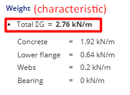

# Test Scenario Document for Bearing Capacity Calculation

**Project Name:** Pfeifer-Suite-Hybridbeam  
**Hybridbeam project name:** 0986_Neubau Logitiskzentrum Warehouse_Unna  
**Position:** U10  
**Tester Name:** Pawel Wojtanowicz  
**Date:** 27.02.25

---

## Instructions

1. Follow each test step carefully.
2. Fill in the **Actual Result** column based on what happens.
3. Mark **Status** as ✅Pass or ❌Fail.
4. Add extra observations in the **Notes** section.
5. Attach screenshots if needed.

---

## Common Data

Common data for for all tests mentioned in this test document are teaken from document: 0986_Neubau Logitiskzentrum Warehouse_Unna_STATIK BH_02-01-2025.pdf (see 'sources' folder).

The common data are as follows:

- static system:  
   
- L = 6m
- self-weight loads: 3kN/m (mounting state / final state)
- HC plate loads: 26,83kN/m (mountig/final)
- mounting loads: 7,25kN/m (mounting)
- installations loads: 12,33kN/m (final)
- live loads: 19,58kN/m (final)
- beam type/size: BHM 20-400
- Hc: 200mm
- Bc: 384mm
- Do: 50mm
- ho: 85mm
- no: 5
- dsg: 25mm
- nu: 0
- dsd: 28mm
- ds: 8mm
- s: 125mm
- hs: 160mm
- ts: 8mm
- B: 680mm
- Bf1: 140mm
- Bf2: 140mm
- tf: 12mm
- ***

## Test Cases

| Test case ID | Test name                          | Description                                               | Steps                                                                                                                                                                                                                                                                                                   | Expected result                                                                 | Actual result                            | Notes                                                                                                                                                                                             | Status |
| ------------ | ---------------------------------- | --------------------------------------------------------- | ------------------------------------------------------------------------------------------------------------------------------------------------------------------------------------------------------------------------------------------------------------------------------------------------------- | ------------------------------------------------------------------------------- | ---------------------------------------- | ------------------------------------------------------------------------------------------------------------------------------------------------------------------------------------------------- | ------ |
| TC001        | Beam self-weight                   | Verification of the correctness of beam self-weight value | 1. Open app   2. Go to Beam tab  3. Enter valid beam size BHM 20-400 (as in source file)  3. Extract the weight of the beam in right hand panel, section: Beam - BHM 20-400                                                                                                                    | total weight = 2.76kN/m (characteristic), 3.73kN/m (design) (as in source file) | no result - see: Notes column            | there is no size BHM 20/400 to choose in the dropdown list,  UX changes needed - no user-friendly                                                                                              | ❌Fail |
| TC002        | Beam self-weight (with workaround) | Verification of the correctness of beam self-weight value | 1. Open app   2. Go to Beam tab  3. Enter beam type/size closes to given, see: common data above (BHM 20-400)  4. Change parametres of the beam as in example doc 4. Save Custom profile as BHM 20-400 4. Extract the weight of the beam in right hand panel, section: Beam - BHM 20-400 | total weight = 2.76kN/m (characteristic), 3.73kN/m (design) (as in source file) | total weight = 2.76kN/m (characteristic) | only characterisctic weight is displayed, it' ok but it's not clear whether weight in the result section is characteristic or design, label to change --> 'Weight (characteristic)', see: tc002-1 | ✅Pass |

---

## Screenshots

- tc002-1  
  

---

### --- END OF DOCUMENT ---

---
