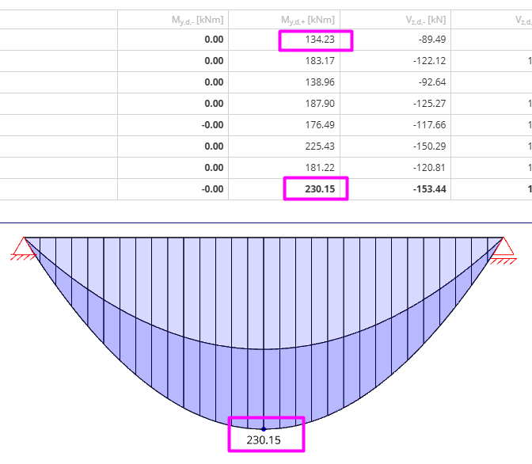
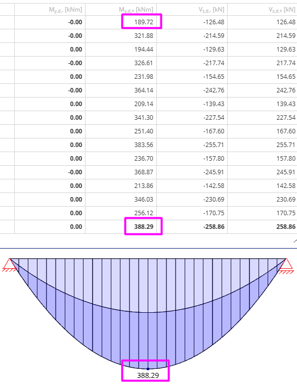
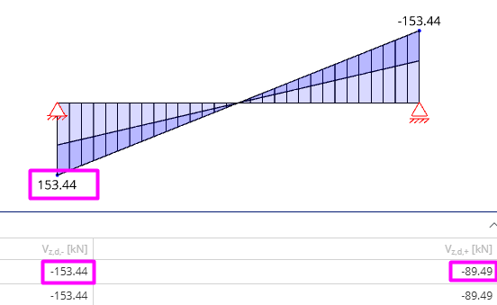
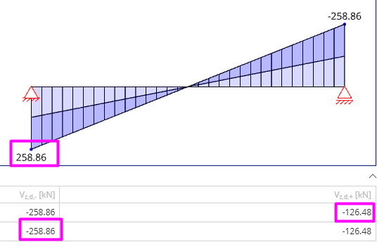
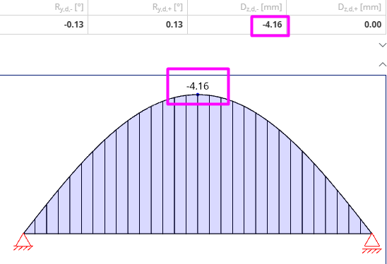

# Test Scenario Document for Static Calculation

**Project Name:** Pfeifer-Suite-Hybridbeam  
**Hybridbeam project name:**   0986_Neubau Logitiskzentrum Warehouse_Unna   
**Position:** U10  
**Tester Name:** Pawel Wojtanowicz  
**Date:** 26.02.25  

---
## Instructions

1. Follow each test step carefully.  
2. Fill in the **Actual Result** column based on what happens.  
3. Mark **Status** as ✅Pass or ❌Fail.  
4. Add extra observations in the **Notes** section.  
5. Attach screenshots if needed.
---
## Common Data

Common data for for all tests mentioned in this test document are teaken from document: 0986_Neubau Logitiskzentrum Warehouse_Unna_STATIK BH_02-01-2025.pdf (see 'sources' folder).  

The common data are as follows:
- static system: 
- L = 6m
- self-weight loads: 3kN/m (mounting state / final state)
- HC plate loads: 26,83kN/m (mountig/final)
- mounting loads: 7,25kN/m (mounting)
- installations loads: 12,33kN/m (final)
- live loads: 19,58kN/m (final)

---

## Test Cases
| Test case ID | Test name | Description | Steps | Expected result | Actual result | Notes | Status |
|-----------|-----------|-----------|-----------|-----------|-----------|-----------|-----------|
| TC001 | Bending moment - mounting state |Verification of the correctness of bending moment value in mounting state | 1. Open app   2. Enter valid data, see: common data above   3. Click calculate button   4. Extract the bending moment value |Mmax = 230,15kNm, Mmin = 134,23kNm (as in source file)|Mmax = 230,15kNm, Mmin = 134,23kNm |see: tc001-1|✅Pass| 
| TC002 | Bending moment - final state |Verification of the correctness of bending moment value in final state | 1. Open app   2. Enter valid data, see: common data above   3. Click calculate button   4. Extract the bending moment value |Mmax = 388,29kNm, Mmin = 189,72kNm (as in source file)|Mmax = 388,29kNm, Mmin = 189,72kNm |see: tc002-1|✅Pass| 
| TC003 | Shear force - mounting state |Verification of the correctness of shear force value in mounting state | 1. Open app   2. Enter valid data, see: common data above   3. Click calculate button   4. Extract the shear force value |Vmax = 153,44kN Vmin = 89,49kN (as in source file)|Vmax = 153,44kN Vmin = 89,49kN |see: tc003-1|✅Pass| 
| TC004 | Shear force - final state |Verification of the correctness of shear force value in final state | 1. Open app   2. Enter valid data, see: common data above   3. Click calculate button   4. Extract the shear force value |Vmax = 258,86kN Vmin = 126,5kN (as in source file)|Vmax = 258,86kN Vmin = 126,48kN |see: tc004-1|✅Pass| 
| TC005 | Deformation - mounting state |Verification of the correctness of deformation value in mounting state | 1. Open app   2. Enter valid data, see: common data above   3. Click calculate button   4. Extract the deformation value |wmax = 27,38mm (as in source file)|wmax = -4,16mm |see: tc005-1  value & graph direction   - to discuss with @WojciechRadkiewicz first|❌Fail| 

---
## Screenshots

- tc001-1  

- tc002-1  

- tc003-1  

- tc004-1  

- tc005-1  

---
### --- END OF DOCUMENT ---
---
