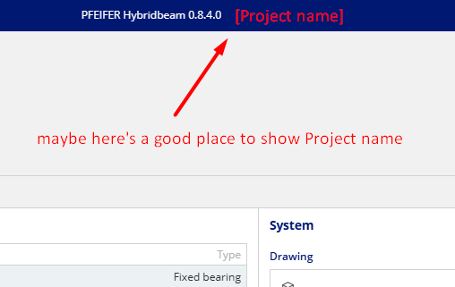
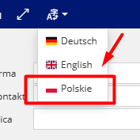
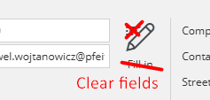
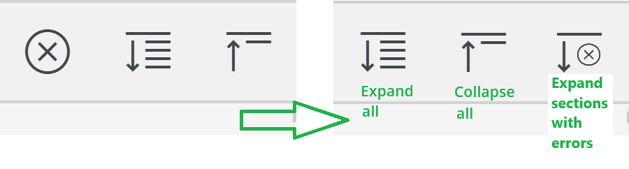
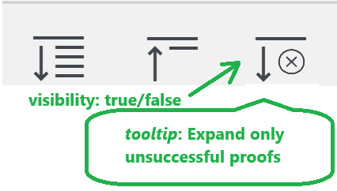

# Test Scenario Document for UX Testing

**Project Name:** Pfeifer-Suite-Hybridbeam  
**Tester Name:** Pawel Wojtanowicz  
**Date:** start: 21.02.25 | end: 28.02.25  

---
## Instructions

1. Follow each test step carefully.  
2. Fill in the **Actual Result** column based on what happens.  
3. Mark **Status** as Pass or Fail.  
4. Add extra observations in the **Notes** section.  
5. Attach screenshots if needed.
---

## Test Cases  
**Please note:** all notes included in the table below have to be considered as UX improvements even when the test status is marked as Pass.
| Test case ID | Test name | Description | Steps | Expected result | Actual result | Notes | Status |
|-----------|-----------|-----------|-----------|-----------|-----------|-----------|-----------|
| TC001 | Save project as downloaded file|Verification of the correctness of saving the project to a file | 1. Open app   2. Click save as File| The file saves correctly |The file saves correctly|No pop-up with path --> to consider|✅Pass| 
| TC002 | Save project as cloud file|Verification of the correctness of saving the project to a cloud file | 1. Open app   2. Click save as Cloud| The file appears in the cloud |The file appears in the cloud||✅Pass|
| TC003 | Open project from downloaded file|Verification of the correctness of opening the project from downloaded file | 1. Open app   2. Click open from File| The pointed file loaded correctly  |The pointed file loaded correctly| The current project should be displayed in highlighted place, see: t003-1 --> to consider |✅Pass|
| TC004 | Open project from cloud file|Verification of the correctness of opening the project from cloud file | 1. Open app   2. Click open from Cloud| The pointed file loaded correctly  |There are no files to choose from in the cloud  | |❌ Fail|
| TC006 | Fullscreen mode|Verification of the correctness of fullscreen mode | 1. Open app   2. Click Fullscreen icon  3. Click Fullscreen icon again| The fullscreen mode is active after first click.   The fullscreen mode is inactive after second click.    | The fullscreen mode is active after first click.   The fullscreen mode is inactive after second click.     |  |✅Pass|
| TC007 | Language switch |Verification of the language switch correctness| 1. Open app   2. Click language switch and change in to English   3. Click language switch and change in to Deutsch   4. Click language switch and change in to Polski| The language has changed in to: English, German, Polish (in this order) | The language has changed in to: English, German, Polish (in this order)   | 'Polskie' --> 'Polski' in dropdown list, see: tc007-1.   The verification of the correctness of other translations is not considered within the scope of this test. |✅Pass|
| TC008 | Home icon | Verification of the Home icon's correctness | 1. Open app   2. Click Home icon| The Pfeifer-Suit 'Start user screen' is open | The Pfeifer-Suit 'Start user screen' is open | No pop-up, like: 'Please save changes' |✅Pass|
| TC009 | New project button | Verification of the New project button's correctness  | 1. Open app   2. Click New project button| The new project is created and becomes the current one. The pop-up with 'Save changes' in between appears. | The new project is created and becomes the current one. The pop-up with 'Save changes' in between appears. | |✅Pass|
| TC010 | Print button | Verification of the Print button's correctness  | 1. Open app   2. Click Print button| The 'File screen' is open and ready to generate report and print after |The 'File screen' is open and ready to generate report and print after | |✅Pass|
| TC011 | Undo/Redo buttons | Verification of the Undo/Redo button's correctness  | 1. Open app   2. Click Fill in button   3. Click Undo button   4. Click Redo button | Inputs filled in. Changes undo - inputs empty. Changes redo - inputs filled in. |Inputs filled in. Changes undo - inputs empty. Changes redo - inputs filled in. | |✅Pass|
| TC012 | Fill-in feature | Verification of the Fill-in feature's correctness  | 1. Open app   2. Click Fill-in button in Customer section   3. Click Fill-in button in Contractor section  | Inputs filled in |Inputs filled in | There is no way to clear inputs automatically. The Clear fields feature with a toggle needed --> toggle to consider, see: tc012-1 |✅Pass|
| TC013 | 'Expand/Collapse all' feature | Verification of the 'Expand/Collapse all' feature's correctness  | 1. Open app   2. Click Collapse button    3. Click Expand button   | Collapse button - all sections collapse. Expand button - all sections expand.  |Collapse button - all sections collapse. Expand button - all sections expand. | Rearrangement of the icons, new icon for Expand errors, see: tc013-1 |✅Pass|
| TC014 | 'Expand error sections' feature | Verification of the 'Expand error sections' feature's correctness  | 1. Open app   2. Choose a big value of one of the actions to have unsuccessful proofs   3. Click 'Calculate' button    4. Click Expand sections with errors on Beam tab| Sections with unsuccessful proofs are collapsed  |Sections with unsuccessful proofs are collapsed | Button visibility set to 'only when Proofs are displayed'. Button tooltip: 'Expand only unsuccessful proofs'. --> to consider, will be more user-friendly, see: tc014-1 |✅Pass|

---
## Screenshots

- tc003-1  

- tc007-1  

- tc012-1  

- tc013-1  

- tc014-1  

---
### --- END OF DOCUMENT ---
---
